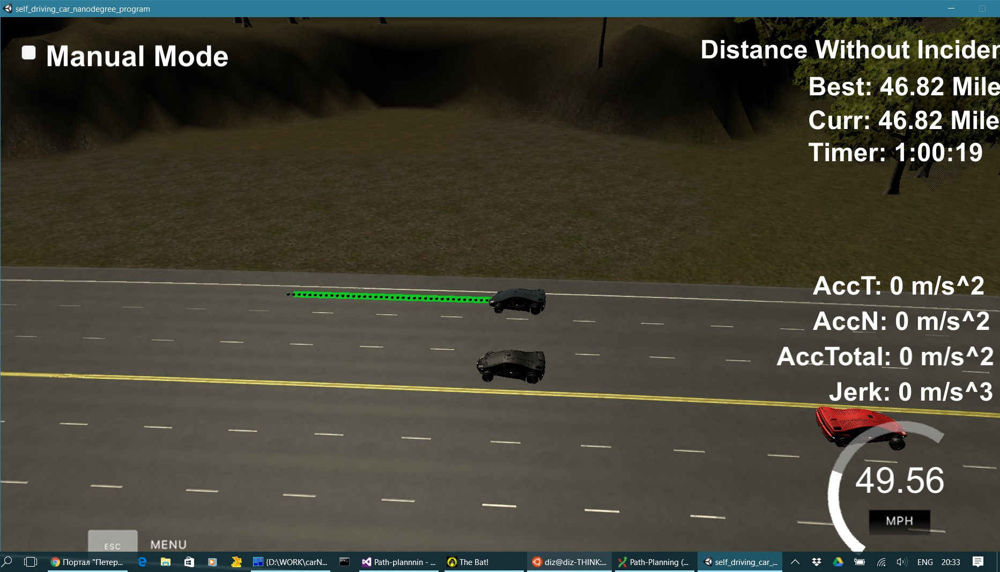

# CarND-Path-Planner
Self-Driving Car Engineer Nanodegree Program

---

This is my (Anton Varfolomeev) solution for the MPC project

---

I (as, I think, most of this nano-degree students) started this project basing on the 
solution proposed by Aaron Brown and David Silver in their 'Project Walkthrough' video.
My primary intention was to add kinematic (bicycle) models for each vehicle and predict
future situations, but it appeared that:

- simple 'heuristic' solution can satisfy the criteria of the project rubric, achieving really large distances
without accident (up to 75 miles) with reasonable speed about 47 miles per hour;

- this solution is simple enough;
- but it required a lot of time to find and eliminate small bugs (given that one need to wait for 15-90 minutes for bug to appear);

That's why here I'm presenting this simple 'heuristic' solution - with the intention to 
investigate more complex solutions in future.

## Code structure

Original 'main' function (in the 'main.cpp' file) was reduced, and now it contains olnly communication
with the simulator and calls to path planning functions.

Beside that:

- several map_waypoints_* vectors were replaced by single Map_waipoints structure (to pass it in function calls);
- 'x' and 'y' vectors were united in the Path structure (for the same reason);

## Path Generation Model

Basic path planning is performed in the 'PathPlan' function (planner.cpp, line 102) by the set of simple 
heuristics:

- keep car in the middle lane if possible (it will give more freedom for maneuvers)
- keep 'safe distance' behind the car ahead. This distance is defined in seconds given the current speed, 
the value (1.7 s) was chosen  based on my experience with ADAS system and it's testing.
- if there is car ahead, change lane if it is possible, if not - reduce speed;
- possibility to change lane is defined by ego-car and surrounding vehicles positions in the future (one second)
- if vehicle ahead is far from the center of it's lane, consider adjusted lane as occupied too

Result of this decision - target lane and speed - is used by the CalculatePoints function to
generate reference points for the spline. (The distance to the 'future' points depends on the current 
speed).

Function 'BuildPath' uses calculated spline to build actual path. Step is calculated for every point
based on the length of the previous segment.

## Known issues

- once in a while (with a period of 15-60 minutes or 10-45 miles) car violates one of the restrictions
(or even ignores one of the cars ahead). Analysis of the log shoes, that around this time previous_path
length drops from normal 45-47 points to 20-30 points. It may mean that, some events in the system caused
delay in server-simulator communication, and simulator used old path
- system behalves sub-optimal in the dense traffic. Here I decided that it will be better to be on the
safe side - and avoid additional creativity in SDC behavior.

